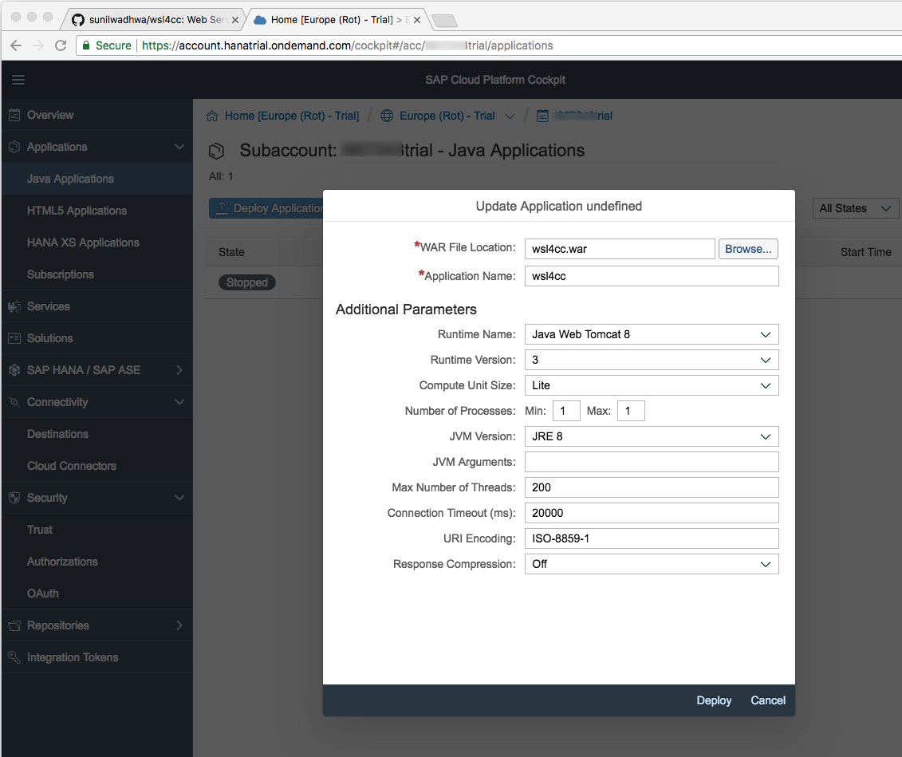
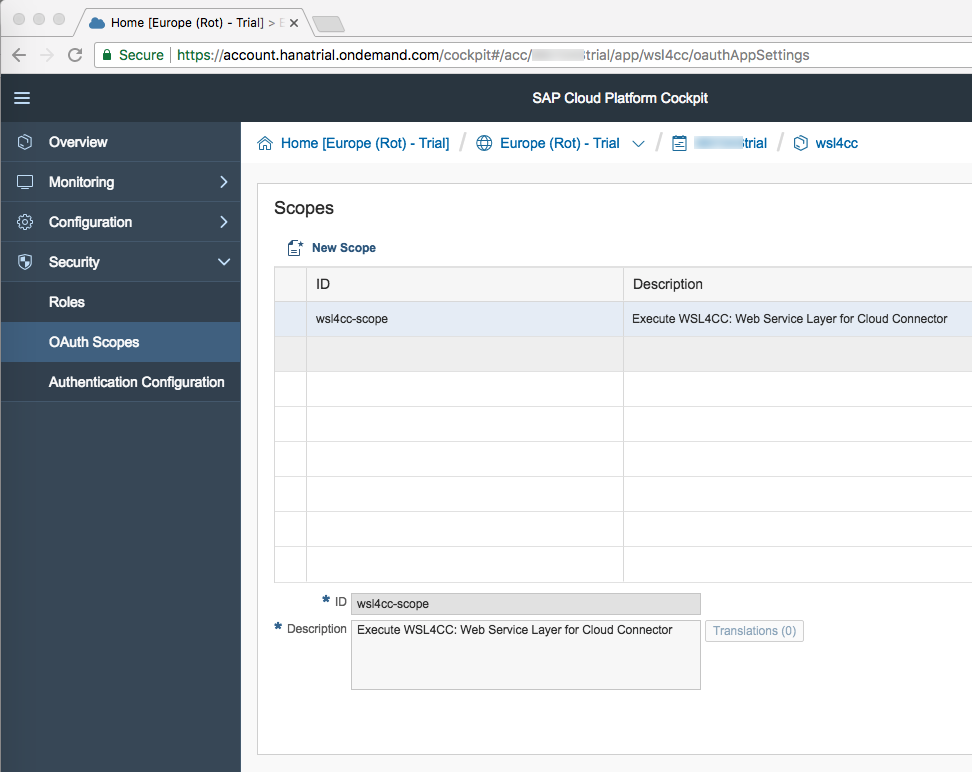
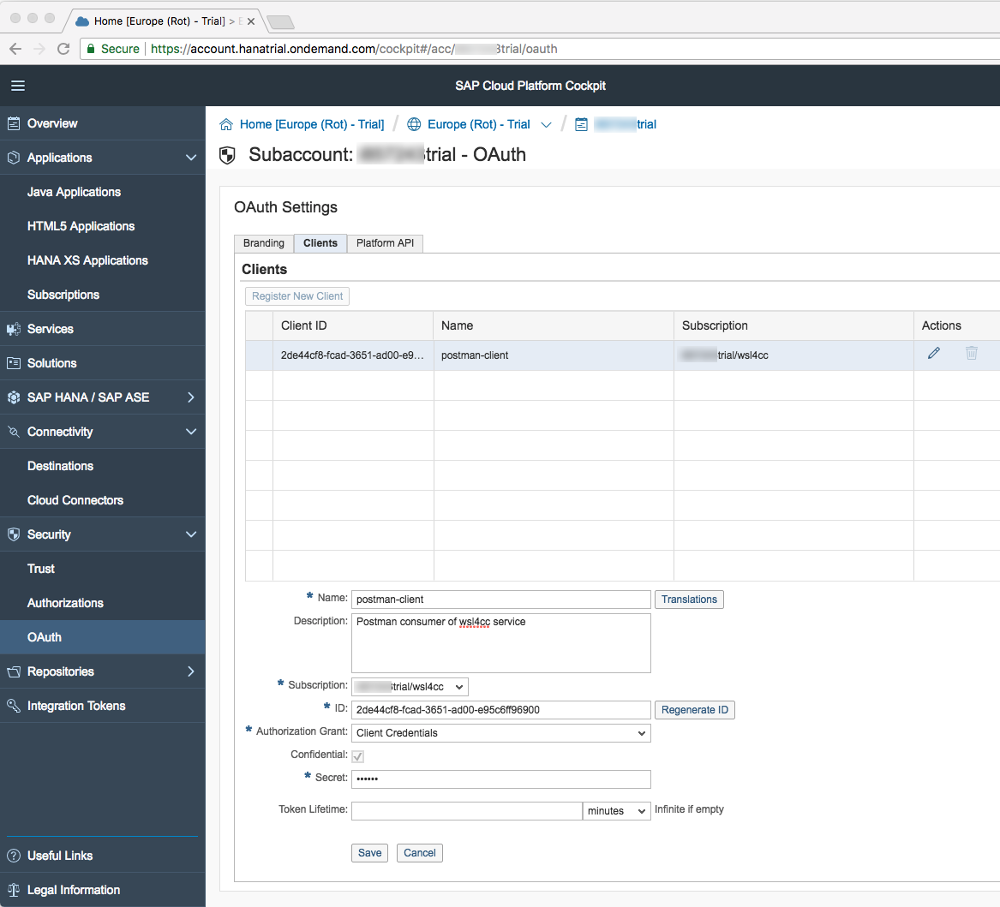
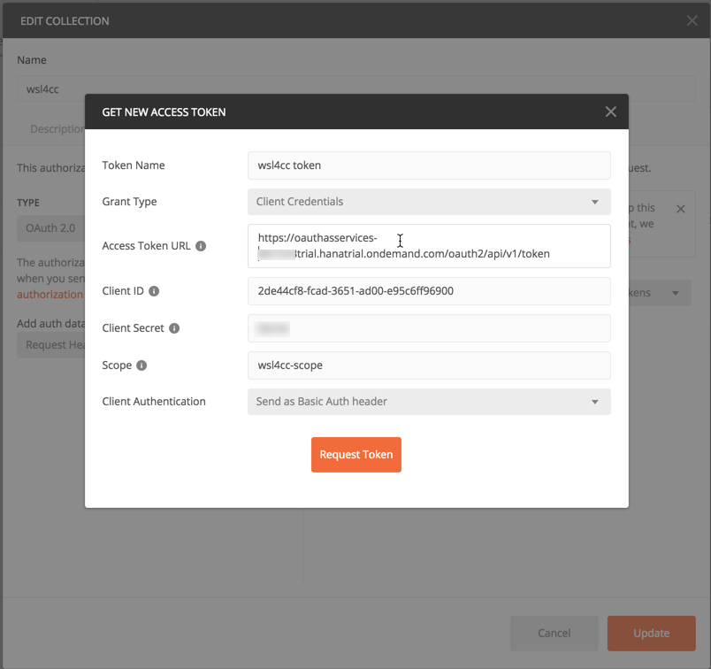

# wsl4cc
Web Service Layer for SAP Cloud Connector (WSL4CC). Pronounced Whistle 4 Cloud Connector.

## 1. Purpose

WSL4CC is a very useful utility application when you are trying to integrate through the SAP Cloud Connector
with an SAP ERP system running on-premise. The approach recommended by SAP to invoke RFCs/BAPIs on an SAP ERP
system is to deploy a Java application running on the SAP Cloud Platform (Neo) and to use the JCo library. More details
about this recommendation can be found in the following blog:

<https://blogs.sap.com/2015/07/13/cloud-connector-a-brief-guide-for-beginners>

The wsl4cc application allows you to invoke these BAPIs using a RESTful API. In other words, wsl4cc provides a simple, thin API which accepts JSON input.

## 2. Installation

1. Download the pre-built wsl4cc.war web archive from the project's release tab.

2. Open the SAP Cloud Platform (Neo) cockpit and click on Java Applications.

3. Click on the Deploy Application button and fill out the folllowing details (leave the remaining fields as default):
   * WAR File Location: {browse to the downloaded wsl4cc.war file location}
   * Application Name: wsl4cc
   * Runtime Name: Java Web Tomcat 8
   * JVM Version: JRE 8
   
   

3. Click on Deploy and then Start the application successfully.

4. The wsl4cc application is secured using the OAuth2 protocol. In order to enable OAuth2, go to the wsl4cc java application page on SAP Cloud Platform cockpit.
   Click on OAuth Scopes tab and create a New Scope with ID `wsl4cc-scope` and description as shown in attached screenshot.
   
   

5. Restart the wsl4cc application and you're all set!

## 3. Client Registration and Configuration

As part of the OAuth authorization service, any client that wishes to consume the wsl4cc service must first be registered. The SAP Cloud Platform provides
an OAuth authorization and token server for your sub-account which may be used for this purpose. In the following example, we will use Postman as the client which will
be the consumer of the service, but in reality this could be any application or library that can consume a RESTful service. You will need to repeat the following
steps for each consumer.

1. Go to your subaccount page and click on the OAuth tab under Security. Then, click on the Clients tab and register a new client with the Client Credentials Grant.
   * Name: {specify a name which identifies the client}
   * Subscription: {choose the wsl4cc application}
   * Authorization Grant: Client Credentials
   * Secret: {specify the client secret password}
   
   

   Keep a note of the Client ID and Client Secret. Also, keep a note of the URLs for your sub-account's authorization and token endpoints. These URLs can be found under
   the Branding tab on the same page.  You will need the information for your consumer in the next step.

2. Configure your REST client (for e.g., Postman) to request an access token from the auth and token servers before invoking the wsl4cc service. This configuration is usually
   dependent on the client, but in this case we will show how to configure Postman.
   
   
   
## 4. Consuming the wsl4cc service

With a valid OAuth token, the client may finally invoke the wsl4cc service to interact with the SAP ERP backend system through the Cloud Connector.

The main REST endpoint is the following:

POST https://{hostname}/wsl4cc/destinations/{dest}/rfc

where {hostname} is your application URL hostname and {dest} is your RFC destination name.

HEADERS
-------
```
Content-Type: application/json
Accept: application/json
Authorization: Bearer token generated by OAuth
```

INPUT BODY
----------

Here are some sample inputs to this endpoint:

1. Input JSON to execute STFC_CONNECTION:

```javascript
{
  "name": "STFC_CONNECTION",
  "input": {
    "REQUTEXT": "Request Text"
  }
}
```

2. Input JSON to get list of employees whose last name is Smith:

```javascript
{
  "name": "BAPI_EMPLOYEE_GETDATA",
  "input": {
    "DATE": "2018-05-21",
    "LASTNAME_M": "Smith"
  }
}
```

EXPECTED OUTPUT
---------------

1. The expected output for STFC_CONNECTION invocation is an HTTP 200 status and the following body:

```javascript
{
    "status": "OK",
    "message": null,
    "output": {
        "ECHOTEXT": "Request Text",
        "RESPTEXT": "SAP R/3 Rel. 740   Sysid: ABA      Date: 20180521   Time: 235932   Logon_Data: 800/IDADMIN/E"
    },
    "tables": null
}
```

2. The expected output for employee data is an HTTP 200 status and the following body (truncated for brevity):

```javascript
{
    "status": "OK",
    "message": null,
    "output": {
        "RETURN": {
            "TYPE": "",
            "CODE": "",
            "MESSAGE": "",
            "LOG_NO": "",
            "LOG_MSG_NO": "000000",
            "MESSAGE_V1": "",
            "MESSAGE_V2": "",
            "MESSAGE_V3": "",
            "MESSAGE_V4": ""
        }
    },
    "tables": {
        "ARCHIVELINK": [ ... ],
        "INTERNAL_CONTROL": [ ... ],
        "PERSONAL_DATA": [ ... ],
        "ORG_ASSIGNMENT": [ ... ],
        "COMMUNICATION": [ ... ]
    }
}
```

